<div align="center">



# Industrial Digital Twin

**A full-stack simulation of an Amazon-style warehouse workcell**

[](https://docs.ros.org/en/humble/)
[](https://cyberbotics.com/)
[](https://python.org)
[](https://docker.com)
[](https://scikit-learn.org)
[](LICENSE)

> A software replica of a real factory that behaves exactly like the real thing —
> every sensor, every fault, every robot movement, live.

</div>

---

## 🎬 System Architecture

<div align="center">

</div>

---

## 🏭 What It Simulates

```
  ┌─────────────────────────────────────────────────────────────────┐
  │                    WAREHOUSE WORKCELL                           │
  │                                                                 │
  │   📦 ──── 📦 ──── 📦                                           │
  │   ══════════════════════► [CONVEYOR BELT] ─────►               │
  │                                        │                       │
  │                               sensor detects box               │
  │                                        │                       │
  │                                        ▼                       │
  │                             🦾 UR5e + Robotiq 2F-85            │
  │                               gripper closes ✊                │
  │                              box physically carried            │
  │                                        │                       │
  │                          ┌─────────────┼─────────────┐         │
  │                          ▼             ▼             ▼         │
  │                       🔴 Red        🔵 Blue       🟠 Orange    │
  │                        Bin           Bin           Bin         │
  └─────────────────────────────────────────────────────────────────┘
                              │
                  ┌───────────┴───────────┐
                  ▼                       ▼
          ROS 2 Topics             SCADA Dashboard
          /plc/state               Live anomaly graph
          /fault/alert             Robot state badge
          /fault/anomaly_score     Fault history
          /cv/detections           Cycle counter
```

---

## 🧠 ML Anomaly Detection Pipeline

```
  Joint Telemetry
  [j1, j2, j3, j4, j5, j6, state, conveyor]
          │
          ▼
  ┌───────────────────┐
  │  Isolation Forest │  ← trained live on 100 normal samples
  │  (scikit-learn)   │
  └─────────┬─────────┘
            │
  ┌─────────▼───────────────────────────┐
  │  score < 0.70  →  🟢  OK            │
  │  score 0.70-0.90 → 🟡  WARNING      │
  │  score > 0.90  →  🔴  CRITICAL      │
  └─────────────────────────────────────┘
```

---

## 🔄 Pick & Place State Machine

```
  ┌─────────┐
  │  WATCH  │◄──────────────────────────────┐
  └────┬────┘                               │
       │ box in pick zone                   │
  ┌────▼──────┐                             │
  │ APPROACH  │                             │
  └────┬──────┘                             │
       │                                    │
  ┌────▼──────┐                             │
  │   PICK    │  ← gripper CLOSE 🤏         │
  └────┬──────┘    box attached             │
       │                                    │
  ┌────▼──────┐                             │
  │   LIFT    │  ← box follows gripper      │
  └────┬──────┘                             │
       │                                    │
  ┌────▼──────┐                             │
  │   SWING   │  → to correct bin           │
  └────┬──────┘                             │
       │                                    │
  ┌────▼──────┐                             │
  │   PLACE   │  ← gripper OPEN 🤲          │
  └────┬──────┘    box snapped to bin       │
       │                                    │
  ┌────▼──────┐                             │
  │   HOME    │  cycle++  restart belt ─────┘
  └───────────┘
```

---

## 📊 Live SCADA Dashboard

```
  ┌─────────────────────────────────────────────────────────────────┐
  │  ⚙  INDUSTRIAL DIGITAL TWIN — LIVE DASHBOARD                   │
  ├───────────────────┬──────────────────┬──────────────────────────┤
  │  CONNECTION       │  ROBOT STATE     │  CYCLES COMPLETED        │
  │  ● Connected      │  ┌─────────────┐ │                          │
  │  to ROS 2         │  │  PICKING    │ │          7               │
  │                   │  └─────────────┘ │                          │
  ├───────────────────┴──────────────────┴───────┬──────────────────┤
  │  ML ANOMALY SCORE                            │  FAULT STATUS    │
  │                                              │                  │
  │   0.531                              [OK]    │  OK              │
  │   ████████████████████░░░░░░░░░░░░░░         │                  │
  ├──────────────────────────────────────┴──────────────────────────┤
  │  ANOMALY SCORE — LIVE (last 60s)                                │
  │  1.0 ┤                                                          │
  │  0.9 ┤ - - - - - CRITICAL - - - - - - - - - - - - - - -       │
  │  0.7 ┤ - - - - - WARNING  - - - - - - - - - - - - - - -       │
  │  0.5 ┤     ∿∿∿∿∿∿∿∿∿∿∿/\/\/\∿∿∿∿∿∿∿∿∿∿∿∿∿∿∿                 │
  │  0.0 ┘                                                          │
  ├─────────────────┬──────────────────────┬────────────────────────┤
  │  CV DETECTIONS  │  FAULT HISTORY       │  CONVEYOR              │
  │                 │  [14:23] F2: Missed  │                        │
  │  RED box → A    │  [14:21] F4: Gripper │  RUNNING               │
  │  BLUE box → B   │  [14:18] F2: Missed  │  AUTO: ON              │
  └─────────────────┴──────────────────────┴────────────────────────┘
```

---

## 🛠️ Tech Stack

| Layer | Technology |
|-------|-----------|
| 3D Simulation | Webots R2025a |
| Robotics | ROS 2 Humble |
| Robot | Universal Robots UR5e |
| Gripper | Robotiq 2F-85 |
| Anomaly Detection | scikit-learn Isolation Forest |
| Dashboard | HTML5 + Chart.js |
| WebSocket | rosbridge_server |
| Container | Docker |
| Language | Python 3.10 |

---

## 🚀 Quick Start

### 1. Start ROS 2

```bash
cd ~/ros2_docker && docker compose up -d
docker exec -it $(docker ps -q) bash

source /opt/ros/humble/setup.bash
source /root/ros2_ws/install/setup.bash
ros2 run digital_twin plc_simulator_node &
ros2 run digital_twin fault_detection_node &
ros2 launch rosbridge_server rosbridge_websocket_launch.xml
```

### 2. Start Mac Bridge

```bash
python3 ~/ros2_ws/mac_bridge.py
```

### 3. Open Webots

```
File → Open World
→ src/digital_twin/digital_twin/worlds/digital_twin.wbt
→ Hit ▶ Play
```

### 4. Open Dashboard

```bash
open ~/ros2_ws/dashboard/index.html
```

---

## 📁 Project Structure

```
industrial-digital-twin/
│
├── 📂 src/digital_twin/
│   ├── 📂 nodes/
│   │   ├── plc_simulator_node.py      ← PLC + fault injection
│   │   ├── fault_detection_node.py    ← ML anomaly detection
│   │   ├── cv_node.py                 ← Computer vision
│   │   └── webots_bridge_node.py      ← Webots ↔ ROS 2
│   ├── 📂 controllers/
│   │   └── pick_place/pick_place.py   ← Robot state machine
│   └── 📂 worlds/
│       └── digital_twin.wbt           ← Webots world
│
├── 📂 dashboard/
│   └── index.html                     ← Live SCADA dashboard
│
└── mac_bridge.py                      ← Mac ↔ Docker relay
```

---

## ✅ Feature Checklist

- [x] 3D warehouse workcell in Webots
- [x] UR5e robot arm with Robotiq 2F-85 gripper
- [x] Conveyor belt with physics-based box transport
- [x] Position-based sensor trigger
- [x] Full pick → lift → swing → place cycle
- [x] Box physically follows gripper during carry
- [x] Color-sorted bins (red / blue / orange)
- [x] ML anomaly detection trained live on joint data
- [x] Live SCADA dashboard via WebSocket → ROS 2
- [x] Fault injection every 20–40 seconds
- [x] Fault history with unique timestamps
- [x] Cycle counter and conveyor status
- [x] Auto box respawn for continuous demo loop
- [x] Dockerized ROS 2 stack

---

<div align="center">

Built as a portfolio project demonstrating **robotics**, **ML**, and **full-stack systems engineering**

</div>
